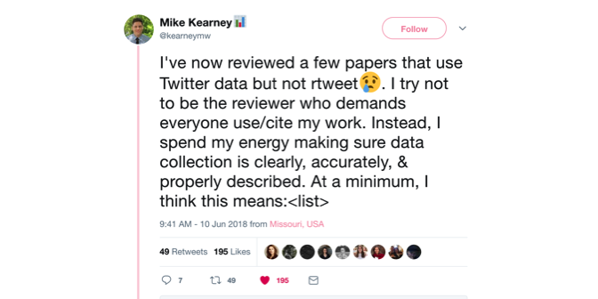
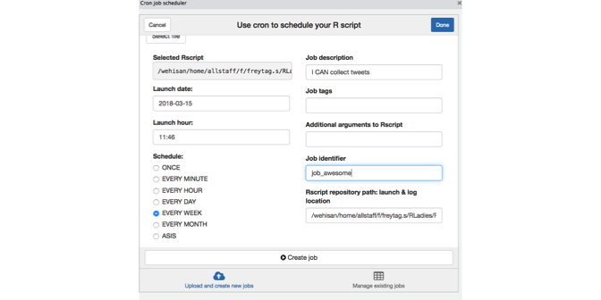
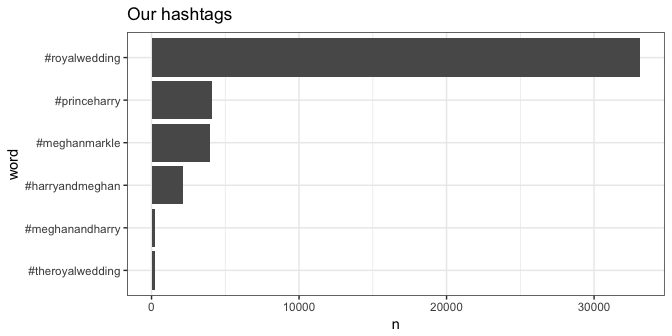
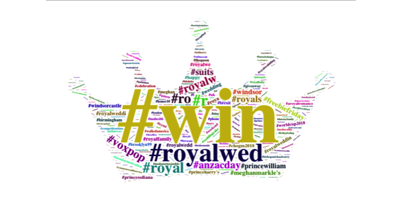
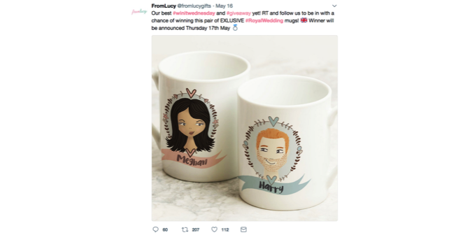
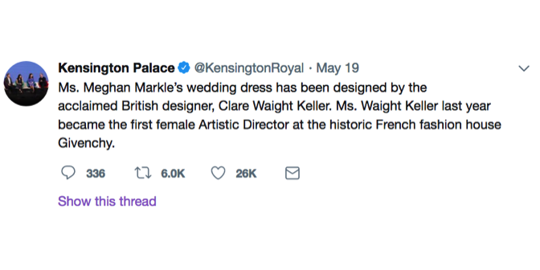
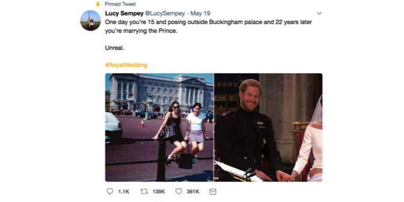
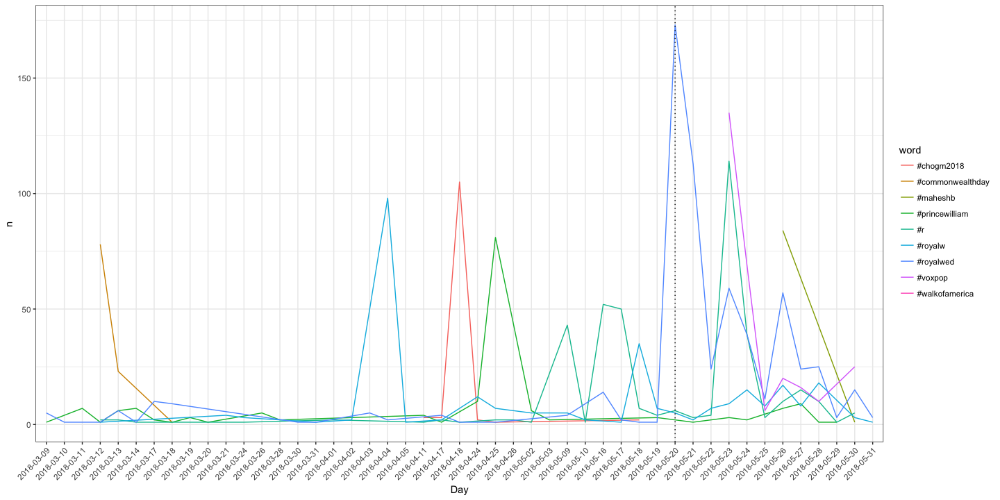

-   [Packages to install](#packages-to-install)
-   [Reference material for the following tutorial](#reference-material-for-the-following-tutorial)
-   [Downloading tweets with `twitteR`](#downloading-tweets-with-twitter)
-   [Downloading tweets for a time series](#downloading-tweets-for-a-time-series)
-   [Analyse the 👑 tweets!](#analyse-the-tweets)
    -   [Step 1: Load tweets into R](#step-1-load-tweets-into-r)
    -   [Step 2: Convert tweets to the tidy text format: `tidytext::unnest_token`](#step-2-convert-tweets-to-the-tidy-text-format-tidytextunnest_token)
    -   [Hashtag frequency](#hashtag-frequency)
    -   [Find popular accounts and tweets](#find-popular-accounts-and-tweets)
    -   [Time series of Royal 👑 Hastags](#time-series-of-royal-hastags)

Packages to install
===================

``` r
install.packages("twitteR")
install.packages("wordcloud2")
install.packages("tidyverse")
install.packages("tidytext")
install.packages("knitr")
install.packages("plotly")
devtools::install_github("ropenscilabs/icon") # to insert icons
devtools::install_github("hadley/emo") # to insert emoji
```

``` r
library(knitr)
library(magick)
```

    ## Linking to ImageMagick 6.9.9.39
    ## Enabled features: cairo, fontconfig, freetype, lcms, pango, rsvg, webp
    ## Disabled features: fftw, ghostscript, x11

``` r
library(png)
library(grid)
library(emo)
library(icon)
library(twitteR)
library(tidyverse)
```

    ## ── Attaching packages ──────────────────────────────────────────────────── tidyverse 1.2.1 ──

    ## ✔ ggplot2 2.2.1     ✔ purrr   0.2.5
    ## ✔ tibble  1.4.2     ✔ dplyr   0.7.5
    ## ✔ tidyr   0.8.1     ✔ stringr 1.3.1
    ## ✔ readr   1.1.1     ✔ forcats 0.3.0

    ## ── Conflicts ─────────────────────────────────────────────────────── tidyverse_conflicts() ──
    ## ✖ dplyr::filter()   masks stats::filter()
    ## ✖ dplyr::id()       masks twitteR::id()
    ## ✖ dplyr::lag()      masks stats::lag()
    ## ✖ dplyr::location() masks twitteR::location()

Reference material for the following tutorial
=============================================

-   [Setting up the Twitter R package for text analytics](https://www.r-bloggers.com/setting-up-the-twitter-r-package-for-text-analytics/)
-   [Obtaining and using access tokens](https://cran.r-project.org/web/packages/rtweet/vignettes/auth.html)
-   [Text mining with R](https://www.tidytextmining.com/index.html)

-   **Refer to `Social_Media_Setup_APIs.Rmd` to setup your Twitter API and connect your R session with Twitter**

Downloading tweets with `twitteR`
=================================

Once you have connected to twitter <!--html_preserve--><i class="fab  fa-twitter "></i><!--/html_preserve--> and accessed your API, you are ready to download tweets. Let's try to return the 3 most recent tweets that contain the \#useR2018 hashtag.

``` r
> useR_tweets <- searchTwitter("#useR2018", n = 3, resultType = "recent")
> useR_tweets <- twListToDF(useR_tweets)
> # kable(useR_tweets[,1:3])
```

The `searchTwitter` function will return a `status` object of 10 most recent tweets that contain \#useR2018 and their properties. This `status` object can be changed into a user-friendly `data.frame` with the function `twListToDF`. This `data.frame` contains the following columns:

-   `$text`: The text of the tweet
-   `$favorited`: Whether you liked it
-   `$favoriteCount`: How many users liked it
-   `$screenName`: Screen name of the user who posted this tweet
-   `$id`: ID of this status (every tweet has an unique ID)
-   `$replyToSN`: Screen name of the user this is in reply to
-   `$replyToUID`: ID of the user this was in reply to
-   `$statusSource`: Source user agent for this tweet
-   `$created`: When this tweet was created
-   `$truncated`: Whether this tweet was truncated
-   `$favorited`: Whether this tweet has been favorited
-   `$retweeted`: TRUE if this tweet has been retweeted
-   `$retweetCount`: The number of times this status has been retweeted

This is a very simple search. Like any search engine, twitter <!--html_preserve--><i class="fab  fa-twitter "></i><!--/html_preserve--> allows much more complicated searches using Boolean logic. For example, we can look for tweets containing \#useR2018 hashtag as well as mentioning \#rstats. If you are unsure whether your query will work, you can try it in the twitter browser.

``` r
> useR_rstats_tweets <- searchTwitter("#useR2018 AND #rstats", n = 10, resultType = "recent")
> useR_rstats_tweets <- twListToDF(useR_rstats_tweets)
> kable(useR_rstats_tweets[3:5, ])
```

Here are some common examples of twitter search queries (none of these are case sensitive):

| Search Query         | Tweets ...                              |
|----------------------|-----------------------------------------|
| from:thomasp85       | sent from Thomas Lin Pedersen           |
| to:thomasp85         | sent to Thomas Lin Pedersen             |
| \`R rules\`          | containing exact phrase                 |
| \#rstats -\#useR2018 | containing \#rstats but not \#useR2018  |
| \#best OR \#useR2018 | containing \#best or \#useR2018 or both |
|                      |                                         |

The `searchTwitter` function also allows you to specify some further restrictions on your searches:

-   `lang`: restricts tweets to a given language, i.e. `"EN"`
-   `geocode`: returns tweets by users located within a given radius of the given latitude/longitude
-   `sinceID`: returns tweets with IDs greater (ie newer) than the specified ID
-   `maxID`: returns tweets with IDs smaller (ie older) than the specified ID
-   `since`: restricts tweets to those since the given date
-   `until`: restricts tweets to those up until the given date

Note that the time restrictions only work for time restrictions within the last two weeks, when you are connecting through a standard API (see discussion in the next section).



It is important to document your data collection process clearly, so it can be reproduced by other people. Mike Kearney, the author of the `rtweet` 📦, recently published a minimum list of information required to reproduce data collection from twitter. We have slightly modified his list here 😉:

-   Source of twitter data: standard, premium or enterprise API
-   The R 📦 you are using
-   The specific function
-   Your search query and any filters (restrictions)

Downloading tweets for a time series
====================================

With a standard API twitter limits users to downloading tweets from the last two weeks. Furthermore, the twitter rate limits cap the number of search results returned to 18,000 every 15 minutes. When you are trying to collect large datasets of tweets or tweets from a longer time period, this poses a problem. One way around this limitation is to set automatic downloads using the `cronjob` 📦 for Linux/Unix or the `scheduler` 📦 for Windows.

We wanted to download tweets relating to the Royal Wedding 👑 of Meghan Markle 👰 and Prince Harry 🤵, held on the 19th of May 2018 in Windsor Castle, UK. In order to obtain representative tweets from before, around, and after the time of the wedding we collected 3,000 tweets every week beginning at the 15th of March to the 31st of May (Thursday mornings, Australian time). We also collected 3,000 tweet every day for 12 days beginning from the 17th of May and ending on the 28th of May. We only collected tweets containing any of the following hashtags:

``` r
> Hashtags <- read_csv("Hashtags.csv", col_names = TRUE)
> kable(Hashtags)
```

| Hashtags          |
|:------------------|
| \#MeghanMarkle    |
| \#TheRoyalWedding |
| \#PrinceHarry     |
| \#HarryAndMeghan  |
| \#MeghanAndHarry  |
| \#RoyalWedding    |

The following was the exact search query we used in our cronjob (we are only going to explain how to work with `cronjob` here 😞). Note that we are no longer requesting the most recent tweets but instead are requesting to be returned a mix of real time and most popular tweets.

``` r
> rla_tweet <- searchTwitter(paste0(Hashtags$Hashtags, collapse = " OR "), n = 3000, 
+     lang = "en")
```

For the cronjob to work, we needed to setup a R script with the all authentication details, the hashtags, the query as well as saving the tweets into a .csv file, which we labled with the date of collection. This R script can then be scheduled to run as often as you like through the cronjob add-in. Just click on the add-in button in RStudio and find cronjob, where you can interactively schedule your script to run:



Analyse the 👑 tweets!
=====================

Step 1: Load tweets into R
--------------------------

-   Load the tidy tools 📦.

``` r
> library(tidyverse)
> library(tidytext)
```

-   Load the time series of royal 👑 tweets.

Here we load the `.csv` files containing the royal tweets downloaded weekly and cohercing them into a `data.frame`. Every `.csv` file was downloaded with the `twitteR` 📦 and saved using the code shown above.

The `Twitter_Data` 📁 contains the time series of royal 👑 tweets:

``` r
> data <- list.files(path = file.path("Twitter_Data"), pattern = ".csv", full.names = TRUE)
> data
```

    ##  [1] "Twitter_Data/2018-03-15.csv"     "Twitter_Data/2018-03-22.csv"    
    ##  [3] "Twitter_Data/2018-03-29.csv"     "Twitter_Data/2018-04-05.csv"    
    ##  [5] "Twitter_Data/2018-04-12.csv"     "Twitter_Data/2018-04-19.csv"    
    ##  [7] "Twitter_Data/2018-04-26.csv"     "Twitter_Data/2018-05-03.csv"    
    ##  [9] "Twitter_Data/2018-05-10.csv"     "Twitter_Data/2018-05-17_day.csv"
    ## [11] "Twitter_Data/2018-05-17.csv"     "Twitter_Data/2018-05-18_day.csv"
    ## [13] "Twitter_Data/2018-05-19_day.csv" "Twitter_Data/2018-05-20_day.csv"
    ## [15] "Twitter_Data/2018-05-21_day.csv" "Twitter_Data/2018-05-22_day.csv"
    ## [17] "Twitter_Data/2018-05-23_day.csv" "Twitter_Data/2018-05-24_day.csv"
    ## [19] "Twitter_Data/2018-05-24.csv"     "Twitter_Data/2018-05-25_day.csv"
    ## [21] "Twitter_Data/2018-05-26_day.csv" "Twitter_Data/2018-05-27_day.csv"
    ## [23] "Twitter_Data/2018-05-28_day.csv" "Twitter_Data/2018-05-29_day.csv"
    ## [25] "Twitter_Data/2018-05-31.csv"

We first load every `.csv` file and save them as argument of the list `tweets` and then combine them into a data.frame.

``` r
> # Read into R all the .csv file and save each of them as an argument of a
> # list
> all_tweets <- lapply(data, function(tweets) {
+     data_tweets <- read_csv(tweets)
+     return(data_tweets)
+ })
> 
> # Combine the .csv file into a data.frame
> all_tweets <- do.call(rbind, all_tweets)
> head(all_tweets)[, c(2:5)]
```

    ## # A tibble: 6 x 4
    ##   text                                   favorited favoriteCount replyToSN
    ##   <chr>                                  <lgl>             <int> <chr>    
    ## 1 RT @acpfonline: This is a wind up sur… FALSE                 0 <NA>     
    ## 2 RT @esricanada: Discover details abou… FALSE                 0 <NA>     
    ## 3 RT @chrisshipitv: While the Royal Fam… FALSE                 0 <NA>     
    ## 4 There should be no taxpayer funding f… FALSE                 0 <NA>     
    ## 5 Doing some homework for the #RoyalWed… FALSE                 0 <NA>     
    ## 6 #AndForWhatItsWorth I<U+2019>m still … FALSE                 0 <NA>

Tweets were downloaded from 2018-03-08 14:01:12 to 2018-05-31 01:45:37.

Now tweets are stored into the column `text` of data frame `all_tweets` and they are stored as a character vector.

The `tidytext` 📦 philosophy, extensively explained in [Text mining with R](https://www.tidytextmining.com/tidytext.html), consist of having a table with **one-token-per-row**. A **token** is defined as a meaningful unit of text. In the simplest way it will be a single word but it can also be pairs/triplets of consecutive words and so on.

Step 2: Convert tweets to the tidy text format: `tidytext::unnest_token`
------------------------------------------------------------------------

The main `tidytext` 📦 function which will do this for us is `unnest_token`. Let's look at a quick example to see how it works!

**Create one-token-per-row data frame**

``` r
> all_tweets %>%
+   filter(!duplicated(all_tweets)) %>% # remove duplicated tweets
+   mutate(tweetID = 1:n()) %>% # set a TweetID column, X1 was too generic
+   select(-X1) %>%
+   unnest_tokens(output = word, input = text, token = "words") %>% # convert tweet in the text column to token = words
+   select(tweetID,word) %>%
+   count(word)
```

    ## # A tibble: 57,332 x 2
    ##    word                                      n
    ##    <chr>                                 <int>
    ##  1 ____                                      3
    ##  2 _____                                     1
    ##  3 ______________                           12
    ##  4 ___________________                       1
    ##  5 _____________________                     3
    ##  6 _____________________________________     1
    ##  7 ___fittaymuu                              2
    ##  8 ___mkc___                                 5
    ##  9 ___q__                                    1
    ## 10 __christan                                3
    ## # ... with 57,322 more rows

There is a lot of useless text in here 😱 !!

**Create one-token-per-row where token are two consecutive words**

``` r
> all_tweets %>% filter(!duplicated(all_tweets)) %>% mutate(tweetID = 1:n()) %>% 
+     select(-X1) %>% unnest_tokens(output = word, input = text, token = "ngrams", 
+     n = 2) %>% select(tweetID, word)
```

    ## # A tibble: 1,801,795 x 2
    ##    tweetID word       
    ##      <int> <chr>      
    ##  1   72068 _ajayv omg 
    ##  2   72068 omg the    
    ##  3   72068 the wedding
    ##  4   72068 wedding in 
    ##  5   72068 in this    
    ##  6   72068 this video 
    ##  7   72068 video was  
    ##  8   72068 was better 
    ##  9   72068 better than
    ## 10   72068 than the   
    ## # ... with 1,801,785 more rows

Looks better but we will do some more tweaks to make it more usable later!

------------------------------------------------------------------------

With the code below, we first create a new column `retweet_from` in the data frame `all_tweets` using `mutate(RT = str_extract(string = text,pattern = "^RT @(\\w+)"))`. In each row, this column will contain the Twitter handle of the user that was retweeted. This is accomplished by using the `str_extract` function from the `stringr` 📦 which extract the pattern "RT @user\_handle" from every retweet (in regular expression form `^RT @(\\w+)`). Finally, `mutate(RT = str_replace_all(RT,"^RT ",""))` will replace every `RT` occurence with nothing so that only the user handle is left in the `retweet_from`column.

``` r
> reg_retweets <- "^RT @(\\w+)"
> all_tweets <- all_tweets %>% mutate(tweetID = 1:n()) %>% select(-X1) %>% mutate(retweet_from = str_extract(text, 
+     reg_retweets)) %>% mutate(retweet_from = str_replace_all(retweet_from, "^RT ", 
+     ""))
> all_tweets[, c("tweetID", "retweet_from", "isRetweet")]
```

    ## # A tibble: 75,000 x 3
    ##    tweetID retweet_from     isRetweet
    ##      <int> <chr>            <lgl>    
    ##  1       1 @acpfonline      TRUE     
    ##  2       2 @esricanada      TRUE     
    ##  3       3 @chrisshipitv    TRUE     
    ##  4       4 <NA>             FALSE    
    ##  5       5 <NA>             FALSE    
    ##  6       6 <NA>             FALSE    
    ##  7       7 @chrisshipitv    TRUE     
    ##  8       8 @chrisshipitv    TRUE     
    ##  9       9 @Raine_Miller    TRUE     
    ## 10      10 @Nova_Magazine17 TRUE     
    ## # ... with 74,990 more rows

Now let's convert everything to the one-token-per-row format 🌟!

The code below will take the data frame `all_tweets` and convert it into a tidy text format. At this stage we do not filter out retweets but we will know which words come from a retweeted tweet and who was retweeted thanks to the columns `isRetweet` and `retweet_from`. The following is a breakdown of the steps performed by the chunk below:

-   Take the `all_tweets` data frame;
-   `filter(!duplicated(all_tweets))` to filter duplicated tweets;
-   `mutate(text = str_replace_all(text, replace_reg, ""))` will clean up the text from all unnecessary signs and language elements that are not meaningful text (summarised in the regular expression `replace_reg`);
-   `unnest_tokens(word, text, token = "regex", pattern = unnest_reg)` is the key part of this step and this is when the 💫 tidy text ✨ will happen!! Here we used a regular expression as our `token`. This is a very useful trick that we borrowed from [Text mining with R](https://www.tidytextmining.com/tidytext.html) 📕 and allows us to keep `#` and `@` from Twitter text.
-   We then remove stop words using the `stop_words` data frame provided with `tidytext` 📦 and we filter out, for any retweet, any word that contains the handle of the user retweeted: `filter(!(word==retweet_from))`. Keeping these words would overestimate the number of times that a user was mentioned since the handle wasn't part of the actual tweet but is appears in retweeted tweets by default.

``` r
> replace_reg <- "https://t.co/[A-Za-z\\d]+|http://[A-Za-z\\d]+|&amp;|&lt;|&gt;|RT|https"
> unnest_reg <- "([^A-Za-z_\\d#@']|'(?![A-Za-z_\\d#@]))"
> all_words <- all_tweets %>% #
+   filter(!duplicated(all_tweets)) %>% #
+   mutate(text = str_replace_all(text, replace_reg, "")) %>%
+   unnest_tokens(word, text, token = "regex", pattern = unnest_reg) %>%
+   filter(!word %in% stop_words$word,str_detect(word, "[a-z]")) %>% 
+   filter(!(word==retweet_from))
```

**Save dataset**

``` r
> dir.create("Twitter_Tutorial_data", showWarnings = FALSE)
> write_csv(all_words, path = "Twitter_Tutorial_data/combined_royal_time_series.csv")
```

Hashtag frequency
-----------------

At the time when we set up our cronjob, it wasn't clear which hashtag would be used to refer to the Royal Wedding. So first let's investigate which hashtag of the ones we searched for was the most popular.

``` r
> our_hash <- all_words %>% mutate(OurTweets = word %in% str_to_lower(Hashtags$Hashtags)) %>% 
+     filter(OurTweets) %>% group_by(word) %>% count() %>% ungroup() %>% mutate(word = reorder(word, 
+     n)) %>% ggplot(aes(x = word, y = n)) + geom_bar(stat = "identity") + coord_flip() + 
+     ggtitle("Our hashtags") + theme_bw()
> 
> our_hash
```



Since hashtags are used to associate tweets to a topic/trend/theme it can be interesting to investigate, which other hashtags were used in co-occurance. Here we find all other hashtags that were used more than 80 times. We will plot these in a wordcloud using the `wordcloud2` 📦. A wordcloud gives greater prominence to words that appear more frequently in the source text by making them appear larger.

``` r
> library(wordcloud2)
> 
> all_hash <- all_words %>% filter(!(word %in% str_to_lower(Hashtags$Hashtags))) %>% 
+     filter(str_detect(string = word, pattern = "#")) %>% group_by(word) %>% 
+     count() %>% filter(n > 80) %>% ungroup() %>% mutate(word = reorder(word, 
+     n)) %>% arrange(desc(word)) %>% rename(freq = n)
> 
> wordcloud2(all_hash)
```

<!--html_preserve-->

<script type="application/json" data-for="htmlwidget-7706ff76958a135def0d">{"x":{"word":["#win","#competition","#winitwednesday","#royalwed","#champ","#royalwedding2018","#champagne","#r","#royal","#ro","#voxpop","#royalw","#anzacday","#meganmarkle","#royals","#suits","#windsor","#freebiefriday","#princewilliam","#meghanmarkle's","#duchessofsussex","#royalweddi","#roya","#royalwedd","#wedding","#royalwe","#windsorcastle","#royalfamily","#royalweddin","#princeharry's","#princessdiana","#chogm2018","#happy","#brexit","#birmingham","#meghan","#commonwealthday","#brooklyn99","#worldcup2018","#t","#uk","#aroyalromance","#sexualchocolate","#giveaway","#celebration","#etsy","#phone","#honor10","#weekend","#walkofamerica","#maheshb","#s","#qanon","#weddingcake","#icymi"],"freq":[1893,1610,644,616,609,525,519,384,366,334,281,279,251,247,233,220,178,175,167,160,160,135,129,128,127,127,125,125,122,119,117,116,114,109,105,102,102,102,100,95,93,91,90,90,90,88,87,87,86,86,85,84,83,81,81],"fontFamily":"Segoe UI","fontWeight":"bold","color":"random-dark","minSize":0,"weightFactor":0.0950871632329636,"backgroundColor":"white","gridSize":0,"minRotation":-0.785398163397448,"maxRotation":0.785398163397448,"shuffle":true,"rotateRatio":0.4,"shape":"circle","ellipticity":0.65,"figBase64":null,"hover":null},"evals":[],"jsHooks":{"render":[{"code":"function(el,x){\n                        console.log(123);\n                        if(!iii){\n                          window.location.reload();\n                          iii = False;\n\n                        }\n  }","data":null}]}}</script>
<!--/html_preserve-->
We can also make a wordcloud in the shape of a crown 👑. However for this to look good we need to also use words with lower frequency.

``` r
> # make wordcloud with more words and in the shape of a crown
> all_hash_more <- all_words %>% filter(!(word %in% str_to_lower(Hashtags$Hashtags))) %>% 
+     filter(str_detect(string = word, pattern = "#")) %>% group_by(word) %>% 
+     count() %>% ungroup() %>% mutate(word = reorder(word, n)) %>% arrange(desc(word)) %>% 
+     rename(freq = n)
> 
> 
> crown_path <- "crown.jpeg"
> hw <- wordcloud2(all_hash_more, size = 1, figPath = crown_path)
> hw
```



Interestingly, when we find a lot of hashtags referring to competitions, i.e. \#win, \#competition, \#WinItWednesday. This may be an artefact of collecting data on Thurdays, as there are lots of companies trying to entice users to retweet their content with giveaway competitions such as \#WinItWednesday:



Find popular accounts and tweets
--------------------------------

Next we turn our attention the accounts and tweets that did really well and gained lots of retweets. First let's find the account that had the most number of retweets in our sampled tweets. For this purpose we will combine number of retweets over distinct tweets by the same account.

``` r
> popular_accounts <- all_tweets %>% filter(isRetweet) %>% group_by(retweet_from) %>% 
+     count() %>% arrange(desc(n))
> 
> kable(popular_accounts[1:5, ])
```

| retweet\_from     |     n|
|:------------------|-----:|
| @KensingtonRoyal  |  1629|
| @giftsinternatio  |  1202|
| @MichaelDapaah    |   833|
| @kathleen\_hanley |   794|
| @HRHHenryWindsor  |   787|

Turns out this was @KensingtonRoyal, which is the offical account of the Kensington Palace and on the day was tweeting out important information like the designer of Meghan Markle's dress:



We might also be interested in the most popular tweet in terms of retweets that we sampled or general in the twitter universe.

``` r
> popular_sample <- all_tweets %>% group_by(text) %>% count() %>% arrange(desc(n))
> 
> popular_general <- all_tweets %>% filter(isRetweet) %>% filter(retweetCount == 
+     max(retweetCount)) %>% filter(row_number() == 1)
> 
> popular_sample$text[1]
```

    ## [1] "RT @MichaelDapaah: Big shaq get<U+2019>s invited to the Royal Wedding <ed><U+00A0><U+00BD><ed><U+00B1><U+00B0><ed><U+00A0><U+00BD><ed><U+00B1><U+0091><ed><U+00A0><U+00BD><ed><U+00B8><U+0085>\n--------------------------------------\n#RoyalWedding https://t.co/jadWP1<U+2026>"

``` r
> popular_general$text
```

    ## [1] "RT @LucySempey: One day you<U+2019>re 15 and posing outside Buckingham palace and 22 years later you<U+2019>re marrying the Prince. \n\nUnreal. \n\n#RoyalWed<U+2026>"



This is not the same tweet in our case 😮. When googling Lucy Sempey you indeed find that her tweet was the most retweeted during the 👑 Royal Wedding (<http://news.abs-cbn.com/trending/05/20/18/more-than-6m-tweets-on-harry-and-meghans-big-day>).

Time series of Royal 👑 Hastags
------------------------------

``` r
> library(plotly)
> 
> # Analyse only retweets
> commonTweetedHash <- all_words %>%
+   separate(created,into=c("Day","Time"),remove=FALSE,sep=" ") %>%
+   filter(str_detect(string = word,pattern = "#")) %>% 
+   filter(!is.na(retweet_from)) %>% # keep only retweets
+   group_by(Day,word) %>%
+   count() %>%
+   ungroup() %>%
+   group_by(word) %>%
+   summarise(MaxOneDay=max(n), # max number of mention in one signle day
+             SumMentions=sum(n)) %>% # sum of all the mentions for this tweets
+   arrange(desc(MaxOneDay))
> kable(head(commonTweetedHash))
```

| word             |  MaxOneDay|  SumMentions|
|:-----------------|----------:|------------:|
| \#royalwedding   |       3751|        33131|
| \#competition    |        963|         1610|
| \#win            |        963|         1893|
| \#champagne      |        482|          519|
| \#winitwednesday |        477|          644|
| \#champ          |        474|          609|

There are around 5K hashtags! We cannot follow them all across time.

Let's do some \# filtering... We will remove our searc \# and the super super popular ones (first 20 of the table abve)! Out of the remaining ones we will keep the most popular.

``` r
> tweetsDay_medium_popular <- all_words %>% 
+   filter(!is.na(retweet_from)) %>%
+   separate(created,into=c("Day","Time"),remove=FALSE,sep=" ") %>%
+   filter(str_detect(string = word,pattern = "#")) %>% # only keep hastags
+   filter(!(word %in% Hashtags$Hashtags) &  # remove our search hastags
+            !(word %in% tolower(Hashtags$Hashtags)) & 
+            !(word %in% commonTweetedHash$word[1:10])) %>%
+   group_by(Day,word) %>% 
+   count() %>%
+   arrange(desc(n))
> 
> # Only plot trends for medium popular hashtags
> tweetsDay <- all_words %>% 
+   separate(created,into=c("Day","Time"),remove=FALSE,sep=" ") %>%
+   filter(str_detect(string = word,pattern = "#")) %>% # only keep hastags
+   filter(word %in% tweetsDay_medium_popular$word[1:10]) %>%
+   group_by(Day,word) %>%
+   count() 
> 
> plot_tweetsDay <- ggplot(tweetsDay,aes(x=Day,y=n,colour=word,group=word)) + geom_line() + theme_bw() + theme(axis.text.x = element_text(angle = 45, hjust = 1)) + 
+   geom_vline(xintercept = c(36), linetype = "dotted")
> plot_tweetsDay
```



``` r
> p1 <- plot_tweetsDay + theme(legend.position = "none")
> ggplotly(p1)
```

<!--html_preserve-->

<script type="application/json" data-for="22ce1c22b739">{"x":{"data":[{"x":[22,23,24,25,26,34],"y":[3,3,105,2,1,2],"text":["Day: 2018-04-11<br />n:   3<br />word: #chogm2018<br />word: #chogm2018","Day: 2018-04-17<br />n:   3<br />word: #chogm2018<br />word: #chogm2018","Day: 2018-04-18<br />n: 105<br />word: #chogm2018<br />word: #chogm2018","Day: 2018-04-24<br />n:   2<br />word: #chogm2018<br />word: #chogm2018","Day: 2018-04-25<br />n:   1<br />word: #chogm2018<br />word: #chogm2018","Day: 2018-05-18<br />n:   2<br />word: #chogm2018<br />word: #chogm2018"],"type":"scatter","mode":"lines","line":{"width":1.88976377952756,"color":"rgba(248,118,109,1)","dash":"solid"},"hoveron":"points","name":"#chogm2018","legendgroup":"#chogm2018","showlegend":true,"xaxis":"x","yaxis":"y","hoverinfo":"text","frame":null},{"x":[4,5,8],"y":[78,23,1],"text":["Day: 2018-03-12<br />n:  78<br />word: #commonwealthday<br />word: #commonwealthday","Day: 2018-03-13<br />n:  23<br />word: #commonwealthday<br />word: #commonwealthday","Day: 2018-03-18<br />n:   1<br />word: #commonwealthday<br />word: #commonwealthday"],"type":"scatter","mode":"lines","line":{"width":1.88976377952756,"color":"rgba(211,146,0,1)","dash":"solid"},"hoveron":"points","name":"#commonwealthday","legendgroup":"#commonwealthday","showlegend":true,"xaxis":"x","yaxis":"y","hoverinfo":"text","frame":null},{"x":[42,46],"y":[84,1],"text":["Day: 2018-05-26<br />n:  84<br />word: #maheshb<br />word: #maheshb","Day: 2018-05-30<br />n:   1<br />word: #maheshb<br />word: #maheshb"],"type":"scatter","mode":"lines","line":{"width":1.88976377952756,"color":"rgba(147,170,0,1)","dash":"solid"},"hoveron":"points","name":"#maheshb","legendgroup":"#maheshb","showlegend":true,"xaxis":"x","yaxis":"y","hoverinfo":"text","frame":null},{"x":[1,3,4,5,6,7,8,9,10,13,14,22,23,25,26,28,29,35,37,39,40,42,43,44,45],"y":[1,7,1,6,7,2,1,3,1,5,2,4,1,10,81,6,2,3,1,3,2,7,9,1,1],"text":["Day: 2018-03-09<br />n:   1<br />word: #princewilliam<br />word: #princewilliam","Day: 2018-03-11<br />n:   7<br />word: #princewilliam<br />word: #princewilliam","Day: 2018-03-12<br />n:   1<br />word: #princewilliam<br />word: #princewilliam","Day: 2018-03-13<br />n:   6<br />word: #princewilliam<br />word: #princewilliam","Day: 2018-03-14<br />n:   7<br />word: #princewilliam<br />word: #princewilliam","Day: 2018-03-17<br />n:   2<br />word: #princewilliam<br />word: #princewilliam","Day: 2018-03-18<br />n:   1<br />word: #princewilliam<br />word: #princewilliam","Day: 2018-03-19<br />n:   3<br />word: #princewilliam<br />word: #princewilliam","Day: 2018-03-20<br />n:   1<br />word: #princewilliam<br />word: #princewilliam","Day: 2018-03-26<br />n:   5<br />word: #princewilliam<br />word: #princewilliam","Day: 2018-03-28<br />n:   2<br />word: #princewilliam<br />word: #princewilliam","Day: 2018-04-11<br />n:   4<br />word: #princewilliam<br />word: #princewilliam","Day: 2018-04-17<br />n:   1<br />word: #princewilliam<br />word: #princewilliam","Day: 2018-04-24<br />n:  10<br />word: #princewilliam<br />word: #princewilliam","Day: 2018-04-25<br />n:  81<br />word: #princewilliam<br />word: #princewilliam","Day: 2018-05-02<br />n:   6<br />word: #princewilliam<br />word: #princewilliam","Day: 2018-05-03<br />n:   2<br />word: #princewilliam<br />word: #princewilliam","Day: 2018-05-19<br />n:   3<br />word: #princewilliam<br />word: #princewilliam","Day: 2018-05-21<br />n:   1<br />word: #princewilliam<br />word: #princewilliam","Day: 2018-05-23<br />n:   3<br />word: #princewilliam<br />word: #princewilliam","Day: 2018-05-24<br />n:   2<br />word: #princewilliam<br />word: #princewilliam","Day: 2018-05-26<br />n:   7<br />word: #princewilliam<br />word: #princewilliam","Day: 2018-05-27<br />n:   9<br />word: #princewilliam<br />word: #princewilliam","Day: 2018-05-28<br />n:   1<br />word: #princewilliam<br />word: #princewilliam","Day: 2018-05-29<br />n:   1<br />word: #princewilliam<br />word: #princewilliam"],"type":"scatter","mode":"lines","line":{"width":1.88976377952756,"color":"rgba(0,186,56,1)","dash":"solid"},"hoveron":"points","name":"#princewilliam","legendgroup":"#princewilliam","showlegend":true,"xaxis":"x","yaxis":"y","hoverinfo":"text","frame":null},{"x":[4,5,6,12,17,22,23,24,26,27,28,30,31,32,33,34,35,36,37,38,39,40,41,42,43,44,45,46],"y":[2,2,1,1,2,1,2,1,2,2,1,43,1,52,50,7,4,6,3,4,114,39,3,10,15,10,1,5],"text":["Day: 2018-03-12<br />n:   2<br />word: #r<br />word: #r","Day: 2018-03-13<br />n:   2<br />word: #r<br />word: #r","Day: 2018-03-14<br />n:   1<br />word: #r<br />word: #r","Day: 2018-03-24<br />n:   1<br />word: #r<br />word: #r","Day: 2018-04-01<br />n:   2<br />word: #r<br />word: #r","Day: 2018-04-11<br />n:   1<br />word: #r<br />word: #r","Day: 2018-04-17<br />n:   2<br />word: #r<br />word: #r","Day: 2018-04-18<br />n:   1<br />word: #r<br />word: #r","Day: 2018-04-25<br />n:   2<br />word: #r<br />word: #r","Day: 2018-04-26<br />n:   2<br />word: #r<br />word: #r","Day: 2018-05-02<br />n:   1<br />word: #r<br />word: #r","Day: 2018-05-09<br />n:  43<br />word: #r<br />word: #r","Day: 2018-05-10<br />n:   1<br />word: #r<br />word: #r","Day: 2018-05-16<br />n:  52<br />word: #r<br />word: #r","Day: 2018-05-17<br />n:  50<br />word: #r<br />word: #r","Day: 2018-05-18<br />n:   7<br />word: #r<br />word: #r","Day: 2018-05-19<br />n:   4<br />word: #r<br />word: #r","Day: 2018-05-20<br />n:   6<br />word: #r<br />word: #r","Day: 2018-05-21<br />n:   3<br />word: #r<br />word: #r","Day: 2018-05-22<br />n:   4<br />word: #r<br />word: #r","Day: 2018-05-23<br />n: 114<br />word: #r<br />word: #r","Day: 2018-05-24<br />n:  39<br />word: #r<br />word: #r","Day: 2018-05-25<br />n:   3<br />word: #r<br />word: #r","Day: 2018-05-26<br />n:  10<br />word: #r<br />word: #r","Day: 2018-05-27<br />n:  15<br />word: #r<br />word: #r","Day: 2018-05-28<br />n:  10<br />word: #r<br />word: #r","Day: 2018-05-29<br />n:   1<br />word: #r<br />word: #r","Day: 2018-05-30<br />n:   5<br />word: #r<br />word: #r"],"type":"scatter","mode":"lines","line":{"width":1.88976377952756,"color":"rgba(0,193,159,1)","dash":"solid"},"hoveron":"points","name":"#r","legendgroup":"#r","showlegend":true,"xaxis":"x","yaxis":"y","hoverinfo":"text","frame":null},{"x":[4,11,12,16,18,20,21,23,25,26,28,30,31,33,34,35,36,37,38,39,40,41,42,43,44,46,47],"y":[1,4,3,1,2,98,1,2,12,7,5,5,2,1,35,7,5,2,7,9,15,8,17,8,18,3,1],"text":["Day: 2018-03-12<br />n:   1<br />word: #royalw<br />word: #royalw","Day: 2018-03-21<br />n:   4<br />word: #royalw<br />word: #royalw","Day: 2018-03-24<br />n:   3<br />word: #royalw<br />word: #royalw","Day: 2018-03-31<br />n:   1<br />word: #royalw<br />word: #royalw","Day: 2018-04-02<br />n:   2<br />word: #royalw<br />word: #royalw","Day: 2018-04-04<br />n:  98<br />word: #royalw<br />word: #royalw","Day: 2018-04-05<br />n:   1<br />word: #royalw<br />word: #royalw","Day: 2018-04-17<br />n:   2<br />word: #royalw<br />word: #royalw","Day: 2018-04-24<br />n:  12<br />word: #royalw<br />word: #royalw","Day: 2018-04-25<br />n:   7<br />word: #royalw<br />word: #royalw","Day: 2018-05-02<br />n:   5<br />word: #royalw<br />word: #royalw","Day: 2018-05-09<br />n:   5<br />word: #royalw<br />word: #royalw","Day: 2018-05-10<br />n:   2<br />word: #royalw<br />word: #royalw","Day: 2018-05-17<br />n:   1<br />word: #royalw<br />word: #royalw","Day: 2018-05-18<br />n:  35<br />word: #royalw<br />word: #royalw","Day: 2018-05-19<br />n:   7<br />word: #royalw<br />word: #royalw","Day: 2018-05-20<br />n:   5<br />word: #royalw<br />word: #royalw","Day: 2018-05-21<br />n:   2<br />word: #royalw<br />word: #royalw","Day: 2018-05-22<br />n:   7<br />word: #royalw<br />word: #royalw","Day: 2018-05-23<br />n:   9<br />word: #royalw<br />word: #royalw","Day: 2018-05-24<br />n:  15<br />word: #royalw<br />word: #royalw","Day: 2018-05-25<br />n:   8<br />word: #royalw<br />word: #royalw","Day: 2018-05-26<br />n:  17<br />word: #royalw<br />word: #royalw","Day: 2018-05-27<br />n:   8<br />word: #royalw<br />word: #royalw","Day: 2018-05-28<br />n:  18<br />word: #royalw<br />word: #royalw","Day: 2018-05-30<br />n:   3<br />word: #royalw<br />word: #royalw","Day: 2018-05-31<br />n:   1<br />word: #royalw<br />word: #royalw"],"type":"scatter","mode":"lines","line":{"width":1.88976377952756,"color":"rgba(0,185,227,1)","dash":"solid"},"hoveron":"points","name":"#royalw","legendgroup":"#royalw","showlegend":true,"xaxis":"x","yaxis":"y","hoverinfo":"text","frame":null},{"x":[1,2,4,5,6,7,8,15,16,19,20,23,24,26,30,32,33,34,35,36,37,38,39,40,41,42,43,44,45,46,47],"y":[5,1,1,6,1,10,9,1,1,5,2,4,1,1,4,14,2,1,1,173,113,24,59,39,11,57,24,25,3,15,3],"text":["Day: 2018-03-09<br />n:   5<br />word: #royalwed<br />word: #royalwed","Day: 2018-03-10<br />n:   1<br />word: #royalwed<br />word: #royalwed","Day: 2018-03-12<br />n:   1<br />word: #royalwed<br />word: #royalwed","Day: 2018-03-13<br />n:   6<br />word: #royalwed<br />word: #royalwed","Day: 2018-03-14<br />n:   1<br />word: #royalwed<br />word: #royalwed","Day: 2018-03-17<br />n:  10<br />word: #royalwed<br />word: #royalwed","Day: 2018-03-18<br />n:   9<br />word: #royalwed<br />word: #royalwed","Day: 2018-03-30<br />n:   1<br />word: #royalwed<br />word: #royalwed","Day: 2018-03-31<br />n:   1<br />word: #royalwed<br />word: #royalwed","Day: 2018-04-03<br />n:   5<br />word: #royalwed<br />word: #royalwed","Day: 2018-04-04<br />n:   2<br />word: #royalwed<br />word: #royalwed","Day: 2018-04-17<br />n:   4<br />word: #royalwed<br />word: #royalwed","Day: 2018-04-18<br />n:   1<br />word: #royalwed<br />word: #royalwed","Day: 2018-04-25<br />n:   1<br />word: #royalwed<br />word: #royalwed","Day: 2018-05-09<br />n:   4<br />word: #royalwed<br />word: #royalwed","Day: 2018-05-16<br />n:  14<br />word: #royalwed<br />word: #royalwed","Day: 2018-05-17<br />n:   2<br />word: #royalwed<br />word: #royalwed","Day: 2018-05-18<br />n:   1<br />word: #royalwed<br />word: #royalwed","Day: 2018-05-19<br />n:   1<br />word: #royalwed<br />word: #royalwed","Day: 2018-05-20<br />n: 173<br />word: #royalwed<br />word: #royalwed","Day: 2018-05-21<br />n: 113<br />word: #royalwed<br />word: #royalwed","Day: 2018-05-22<br />n:  24<br />word: #royalwed<br />word: #royalwed","Day: 2018-05-23<br />n:  59<br />word: #royalwed<br />word: #royalwed","Day: 2018-05-24<br />n:  39<br />word: #royalwed<br />word: #royalwed","Day: 2018-05-25<br />n:  11<br />word: #royalwed<br />word: #royalwed","Day: 2018-05-26<br />n:  57<br />word: #royalwed<br />word: #royalwed","Day: 2018-05-27<br />n:  24<br />word: #royalwed<br />word: #royalwed","Day: 2018-05-28<br />n:  25<br />word: #royalwed<br />word: #royalwed","Day: 2018-05-29<br />n:   3<br />word: #royalwed<br />word: #royalwed","Day: 2018-05-30<br />n:  15<br />word: #royalwed<br />word: #royalwed","Day: 2018-05-31<br />n:   3<br />word: #royalwed<br />word: #royalwed"],"type":"scatter","mode":"lines","line":{"width":1.88976377952756,"color":"rgba(97,156,255,1)","dash":"solid"},"hoveron":"points","name":"#royalwed","legendgroup":"#royalwed","showlegend":true,"xaxis":"x","yaxis":"y","hoverinfo":"text","frame":null},{"x":[39,40,41,42,43,44,46],"y":[135,69,6,20,16,10,25],"text":["Day: 2018-05-23<br />n: 135<br />word: #voxpop<br />word: #voxpop","Day: 2018-05-24<br />n:  69<br />word: #voxpop<br />word: #voxpop","Day: 2018-05-25<br />n:   6<br />word: #voxpop<br />word: #voxpop","Day: 2018-05-26<br />n:  20<br />word: #voxpop<br />word: #voxpop","Day: 2018-05-27<br />n:  16<br />word: #voxpop<br />word: #voxpop","Day: 2018-05-28<br />n:  10<br />word: #voxpop<br />word: #voxpop","Day: 2018-05-30<br />n:  25<br />word: #voxpop<br />word: #voxpop"],"type":"scatter","mode":"lines","line":{"width":1.88976377952756,"color":"rgba(219,114,251,1)","dash":"solid"},"hoveron":"points","name":"#voxpop","legendgroup":"#voxpop","showlegend":true,"xaxis":"x","yaxis":"y","hoverinfo":"text","frame":null},{"x":[22],"y":[86],"text":"Day: 2018-04-11<br />n:  86<br />word: #walkofamerica<br />word: #walkofamerica","type":"scatter","mode":"lines","line":{"width":1.88976377952756,"color":"rgba(255,97,195,1)","dash":"solid"},"hoveron":"points","name":"#walkofamerica","legendgroup":"#walkofamerica","showlegend":true,"xaxis":"x","yaxis":"y","hoverinfo":"text","frame":null},{"x":[36,36],"y":[-7.6,181.6],"text":"xintercept: 36","type":"scatter","mode":"lines","line":{"width":1.88976377952756,"color":"rgba(0,0,0,1)","dash":"dot"},"hoveron":"points","showlegend":false,"xaxis":"x","yaxis":"y","hoverinfo":"text","frame":null}],"layout":{"margin":{"t":30.6118721461187,"r":7.30593607305936,"b":64.1885173701667,"l":43.1050228310502},"plot_bgcolor":"rgba(255,255,255,1)","paper_bgcolor":"rgba(255,255,255,1)","font":{"color":"rgba(0,0,0,1)","family":"","size":14.6118721461187},"xaxis":{"domain":[0,1],"type":"linear","autorange":false,"tickmode":"array","range":[0.4,47.6],"ticktext":["2018-03-09","2018-03-10","2018-03-11","2018-03-12","2018-03-13","2018-03-14","2018-03-17","2018-03-18","2018-03-19","2018-03-20","2018-03-21","2018-03-24","2018-03-26","2018-03-28","2018-03-30","2018-03-31","2018-04-01","2018-04-02","2018-04-03","2018-04-04","2018-04-05","2018-04-11","2018-04-17","2018-04-18","2018-04-24","2018-04-25","2018-04-26","2018-05-02","2018-05-03","2018-05-09","2018-05-10","2018-05-16","2018-05-17","2018-05-18","2018-05-19","2018-05-20","2018-05-21","2018-05-22","2018-05-23","2018-05-24","2018-05-25","2018-05-26","2018-05-27","2018-05-28","2018-05-29","2018-05-30","2018-05-31"],"tickvals":[1,2,3,4,5,6,7,8,9,10,11,12,13,14,15,16,17,18,19,20,21,22,23,24,25,26,27,28,29,30,31,32,33,34,35,36,37,38,39,40,41,42,43,44,45,46,47],"ticks":"outside","tickcolor":"rgba(51,51,51,1)","ticklen":3.65296803652968,"tickwidth":0.66417600664176,"showticklabels":true,"tickfont":{"color":"rgba(77,77,77,1)","family":"","size":11.689497716895},"tickangle":-45,"showline":false,"linecolor":null,"linewidth":0,"showgrid":true,"gridcolor":"rgba(235,235,235,1)","gridwidth":0.66417600664176,"zeroline":false,"anchor":"y","title":"Day","titlefont":{"color":"rgba(0,0,0,1)","family":"","size":14.6118721461187},"hoverformat":".2f"},"yaxis":{"domain":[0,1],"type":"linear","autorange":false,"tickmode":"array","range":[-7.6,181.6],"ticktext":["0","50","100","150"],"tickvals":[8.88178419700125e-16,50,100,150],"ticks":"outside","tickcolor":"rgba(51,51,51,1)","ticklen":3.65296803652968,"tickwidth":0.66417600664176,"showticklabels":true,"tickfont":{"color":"rgba(77,77,77,1)","family":"","size":11.689497716895},"tickangle":-0,"showline":false,"linecolor":null,"linewidth":0,"showgrid":true,"gridcolor":"rgba(235,235,235,1)","gridwidth":0.66417600664176,"zeroline":false,"anchor":"x","title":"n","titlefont":{"color":"rgba(0,0,0,1)","family":"","size":14.6118721461187},"hoverformat":".2f"},"shapes":[{"type":"rect","fillcolor":"transparent","line":{"color":"rgba(51,51,51,1)","width":0.66417600664176,"linetype":"solid"},"yref":"paper","xref":"paper","x0":0,"x1":1,"y0":0,"y1":1}],"showlegend":false,"legend":{"bgcolor":"rgba(255,255,255,1)","bordercolor":"transparent","borderwidth":1.88976377952756,"font":{"color":"rgba(0,0,0,1)","family":"","size":11.689497716895}},"hovermode":"closest"},"source":"A","attrs":{"22ce20516acf":{"x":{},"y":{},"colour":{},"type":"ggplotly"},"22ce413b4c9c":{"xintercept":{}}},"cur_data":"22ce20516acf","visdat":{"22ce20516acf":["function (y) ","x"],"22ce413b4c9c":["function (y) ","x"]},"config":{"modeBarButtonsToAdd":[{"name":"Collaborate","icon":{"width":1000,"ascent":500,"descent":-50,"path":"M487 375c7-10 9-23 5-36l-79-259c-3-12-11-23-22-31-11-8-22-12-35-12l-263 0c-15 0-29 5-43 15-13 10-23 23-28 37-5 13-5 25-1 37 0 0 0 3 1 7 1 5 1 8 1 11 0 2 0 4-1 6 0 3-1 5-1 6 1 2 2 4 3 6 1 2 2 4 4 6 2 3 4 5 5 7 5 7 9 16 13 26 4 10 7 19 9 26 0 2 0 5 0 9-1 4-1 6 0 8 0 2 2 5 4 8 3 3 5 5 5 7 4 6 8 15 12 26 4 11 7 19 7 26 1 1 0 4 0 9-1 4-1 7 0 8 1 2 3 5 6 8 4 4 6 6 6 7 4 5 8 13 13 24 4 11 7 20 7 28 1 1 0 4 0 7-1 3-1 6-1 7 0 2 1 4 3 6 1 1 3 4 5 6 2 3 3 5 5 6 1 2 3 5 4 9 2 3 3 7 5 10 1 3 2 6 4 10 2 4 4 7 6 9 2 3 4 5 7 7 3 2 7 3 11 3 3 0 8 0 13-1l0-1c7 2 12 2 14 2l218 0c14 0 25-5 32-16 8-10 10-23 6-37l-79-259c-7-22-13-37-20-43-7-7-19-10-37-10l-248 0c-5 0-9-2-11-5-2-3-2-7 0-12 4-13 18-20 41-20l264 0c5 0 10 2 16 5 5 3 8 6 10 11l85 282c2 5 2 10 2 17 7-3 13-7 17-13z m-304 0c-1-3-1-5 0-7 1-1 3-2 6-2l174 0c2 0 4 1 7 2 2 2 4 4 5 7l6 18c0 3 0 5-1 7-1 1-3 2-6 2l-173 0c-3 0-5-1-8-2-2-2-4-4-4-7z m-24-73c-1-3-1-5 0-7 2-2 3-2 6-2l174 0c2 0 5 0 7 2 3 2 4 4 5 7l6 18c1 2 0 5-1 6-1 2-3 3-5 3l-174 0c-3 0-5-1-7-3-3-1-4-4-5-6z"},"click":"function(gd) { \n        // is this being viewed in RStudio?\n        if (location.search == '?viewer_pane=1') {\n          alert('To learn about plotly for collaboration, visit:\\n https://cpsievert.github.io/plotly_book/plot-ly-for-collaboration.html');\n        } else {\n          window.open('https://cpsievert.github.io/plotly_book/plot-ly-for-collaboration.html', '_blank');\n        }\n      }"}],"cloud":false},"highlight":{"on":"plotly_click","persistent":false,"dynamic":false,"selectize":false,"opacityDim":0.2,"selected":{"opacity":1}},"base_url":"https://plot.ly"},"evals":["config.modeBarButtonsToAdd.0.click"],"jsHooks":{"render":[{"code":"function(el, x) { var ctConfig = crosstalk.var('plotlyCrosstalkOpts').set({\"on\":\"plotly_click\",\"persistent\":false,\"dynamic\":false,\"selectize\":false,\"opacityDim\":0.2,\"selected\":{\"opacity\":1}}); }","data":null}]}}</script>
<!--/html_preserve-->
-   Peak of tweets for `#royalwedding` on the 20th of May

-   **\#chogm2018**: Commonwealth Heads of Government Meeting 2018 16-19 April 2018

``` r
> chogm <- all_words[all_words$word %in% "#chogm2018", ]
> dim(chogm)
```

    ## [1] 116  18

``` r
> sort(table(chogm$retweet_from))
```

    ## 
    ## @AlexDEMitchell      @hannarrr_   @PScotlandCSG  @mmarklefancom 
    ##               1               1               1               2 
    ##        @The_ACU         @PlanUK    @RoyalDickie   @RE_DailyMail 
    ##               2               3               3             103

``` r
> chogm[chogm$retweet_from %in% "@RE_DailyMail", c("tweetID")]
```

    ## # A tibble: 103 x 1
    ##    tweetID
    ##      <int>
    ##  1   17515
    ##  2   17041
    ##  3   16333
    ##  4   16332
    ##  5   16328
    ##  6   16327
    ##  7   16326
    ##  8   16323
    ##  9   16321
    ## 10   16319
    ## # ... with 93 more rows

``` r
> all_tweets$text[all_tweets$tweetID %in% c("15052", "15054", "15119")]
```

    ## [1] "RT @RE_DailyMail: #PrinceHarry and #MeghanMarkle have arrived to speak to inspirational Commonwealth Youth leaders #CHOGM2018 https://t.co/<U+2026>"       
    ## [2] "RT @RE_DailyMail: Video: #PrinceHarry and #MeghanMarkle meet delegates at today<U+2019>s Commonwealth Youth Forum event #CHOGM2018 https://t.co/oH<U+2026>"
    ## [3] "RT @RE_DailyMail: #PrinceHarry and #MeghanMarkle have arrived to speak to inspirational Commonwealth Youth leaders #CHOGM2018 https://t.co/<U+2026>"


